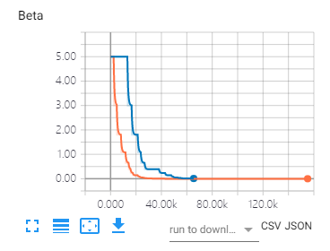
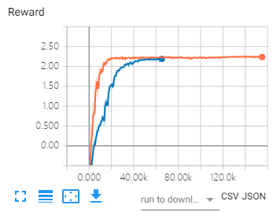
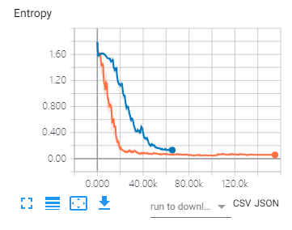

# Pensieve PPO

## About Pensive-PPO

This is an easy TensorFlow implementation of Pensieve[1]. 
In detail, we trained Pensieve via PPO2 rather than A3C.
It's a stable version, which has already prepared the training set and the test set, and you can run the repo easily: just type

```
python train.py
```

instead. Results will be evaluated on the test set (from HSDPA) every 300 epochs.

## Experimental Results

We report the training curve of entropy weight beta, reward, and entropy respectively. Results are evaluated over the Oboe network traces.

<p align="center">
    
</p>


Please feel free to let me know if you have any questions.

[1] Mao H, Netravali R, Alizadeh M. Neural adaptive video streaming with pensieve[C]//Proceedings of the Conference of the ACM Special Interest Group on Data Communication. ACM, 2017: 197-210.

