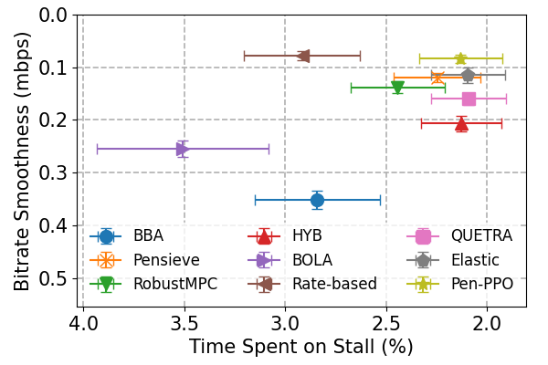

# Pensieve PPO

### Update
*Dec. 28, 2021: we have upgraded Pensieve-PPO with several state-of-the-art technologies, such as Dual-Clip PPO and adaptive entropy decay.*

## About Pensive-PPO

This is an easy TensorFlow implementation of Pensieve [1]. 
We trained Pensieve via PPO rather than A3C.

It's a stable version, which has already prepared the training set and the test set.

You can run the repo via typing:

```
python train.py
```

instead. Results will be evaluated on the test set (from HSDPA) every 300 epochs.

## Tensorboard

During the training process, we can leverage Tensorboard for monitoring current status.

```
tensorboard --logdir=./
```

## Pretrained Model

Furthermore, we have also added the pretrained model in https://github.com/godka/Pensieve-PPO/tree/master/src/pretrain

The model improves 7.03% (0.924->0.989) on average QoE compared with the original Pensieve model [1].
The detailed performance are shown as follows.

<p align="center">
    
</p>

Feel free to let me know if you have any questions.

## More Reinforcement Learning Algorithms

More implementation please refer to:

DQN: https://github.com/godka/Pensieve-PPO/tree/dqn

SAC: https://github.com/godka/Pensieve-PPO/tree/SAC or https://github.com/godka/Pensieve-SAC

[1] Mao H, Netravali R, Alizadeh M. Neural adaptive video streaming with pensieve[C]//Proceedings of the Conference of the ACM Special Interest Group on Data Communication. ACM, 2017: 197-210.


